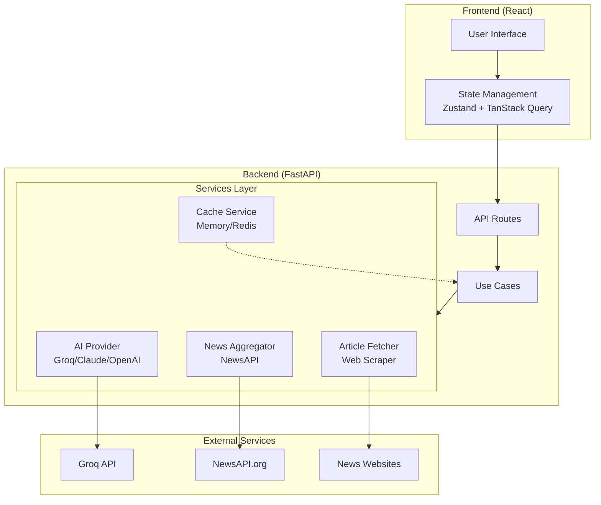
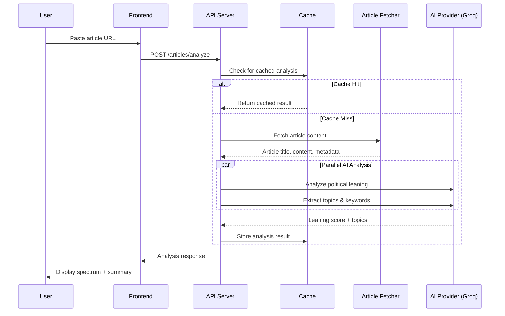
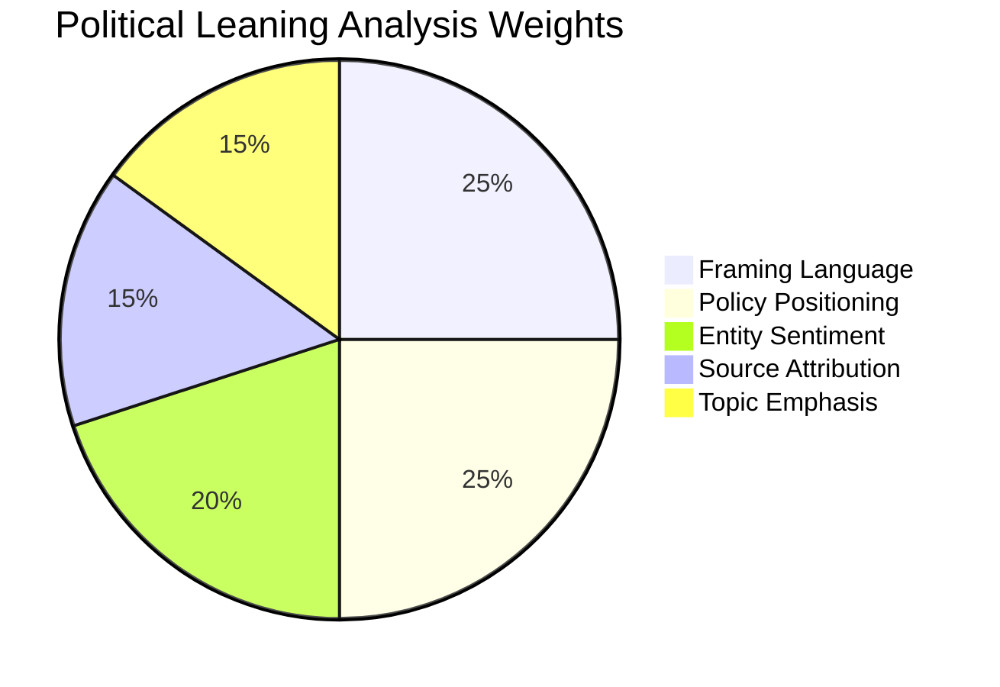
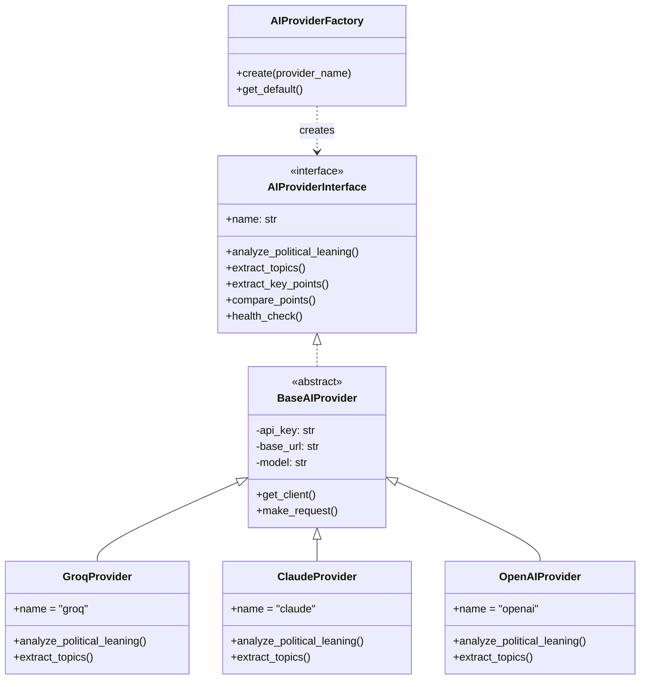
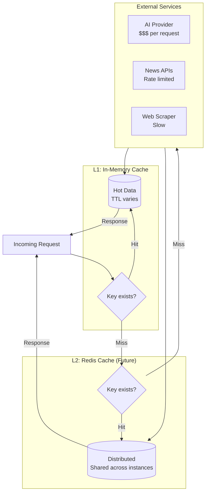
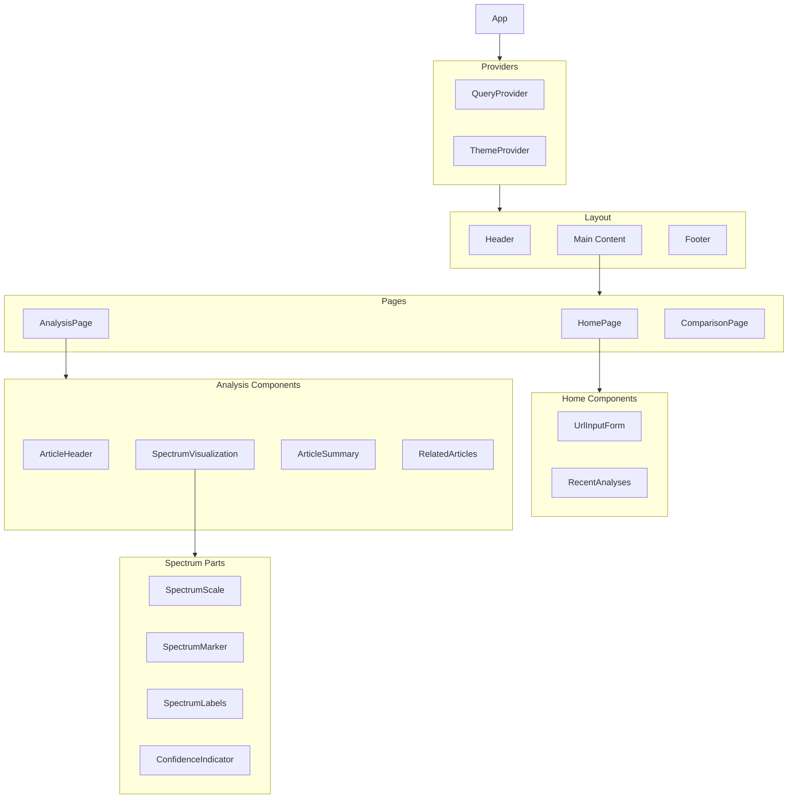
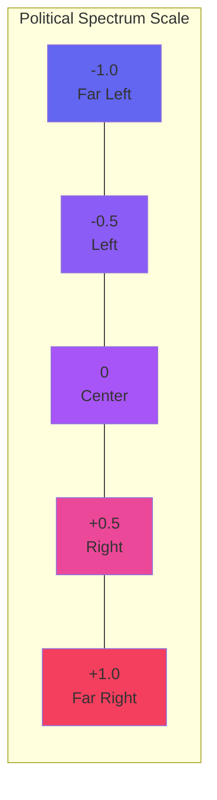
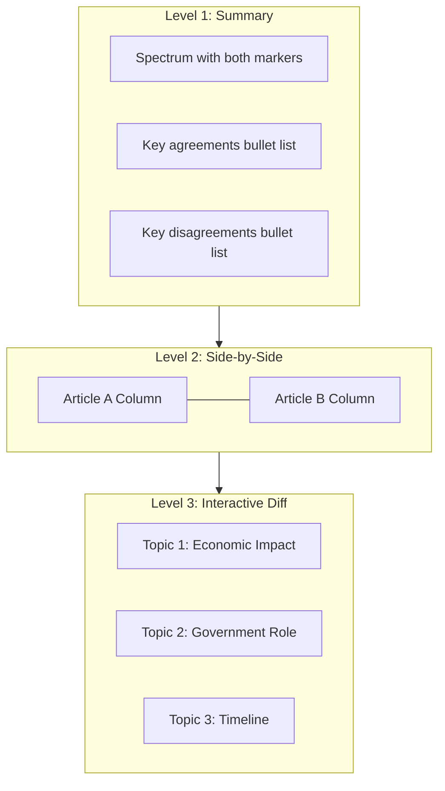
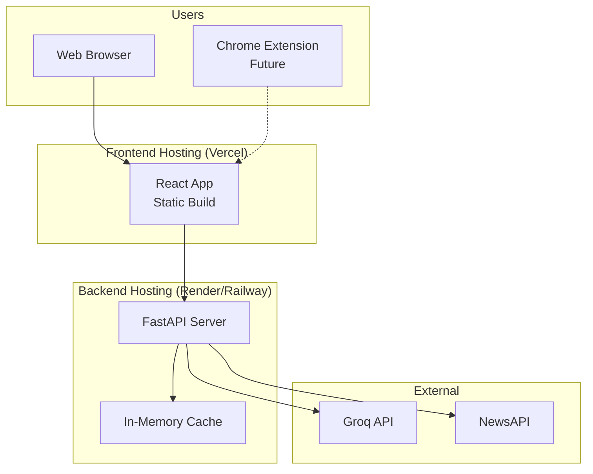

# Spectrum - Architecture Diagrams

## System Overview

## Article Analysis Flow

## Political Analysis Dimensions

## AI Provider Strategy Pattern

## Caching Strategy

## Frontend Component Hierarchy

## Data Flow: Full Analysis Workflow

```mermaid
flowchart LR
    subgraph Input
        URL[Article URL]
    end

    subgraph Fetch["1. Fetch"]
        Scrape[Scrape Content]
        Parse[Extract Text]
    end

    subgraph Analyze["2. Analyze"]
        Leaning[Political Leaning<br/>-1 to +1]
        Topics[Topic Extraction<br/>Keywords]
        Points[Key Points<br/>Claims]
    end

    subgraph Related["3. Find Related"]
        Search[Search NewsAPI]
        Filter[Filter & Dedupe]
    end

    subgraph Compare["4. Compare"]
        Align[Align Topics]
        Agree[Find Agreements]
        Disagree[Find Disagreements]
    end

    subgraph Output
        Result[Analysis Result<br/>+ Related Articles<br/>+ Comparison]
    end

    URL --> Fetch
    Fetch --> Analyze
    Analyze --> Related
    Related --> Compare
    Compare --> Output
```

## Political Spectrum Visualization

## Comparison View Levels

## Deployment Architecture

